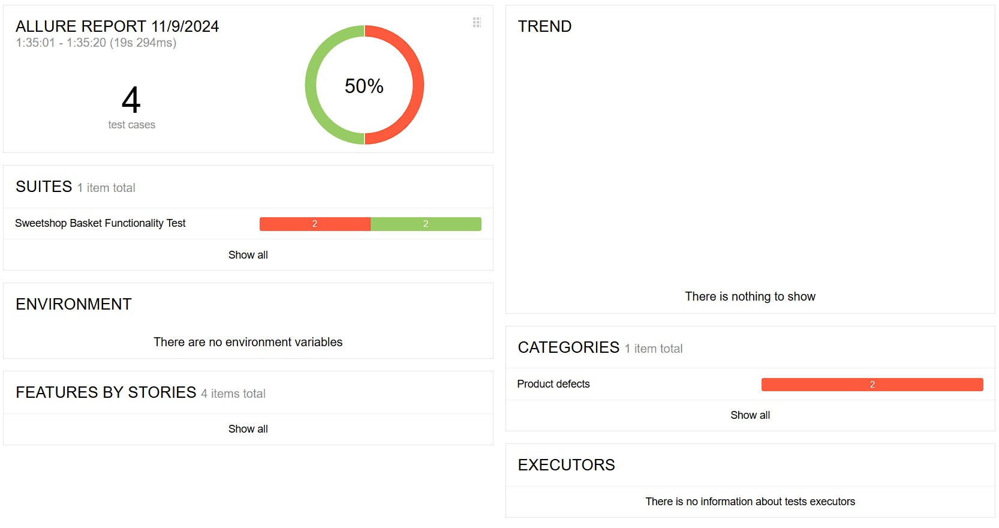
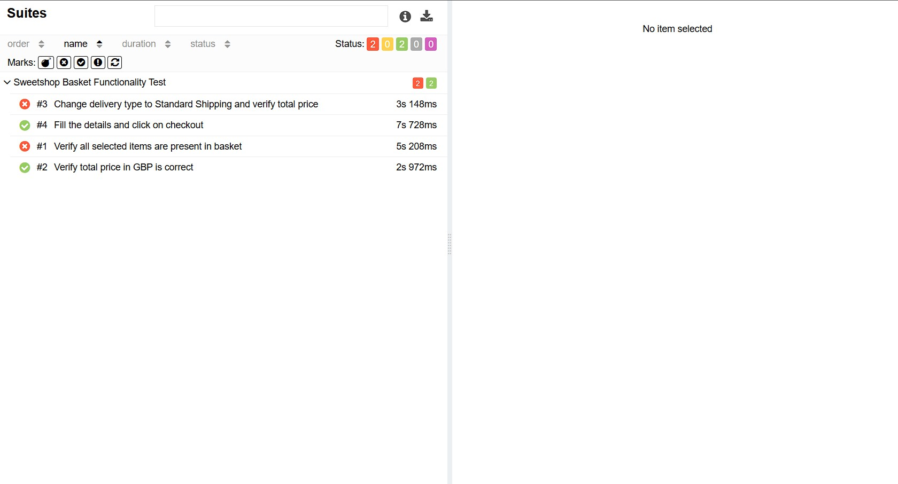

## Sweetshop Basket Functionality Test

**Objective:**  

The project is designed to automate the testing of basket functionality on the [Sweetshop](https://sweetshop.netlify.app/) website. The purpose of these tests is to verify the correct addition of items to the basket, the calculation of the total purchase amount, the change of delivery type, and the completion of the checkout form.

**Tools:**  
- Cypress (for automated testing)
- JavaScript
- Page Object Model (POM) for organizing tests
- Allure (for reporting)
- GitHub Pages (for hosting reports)

**Project Structure:** 

`cypress/fixtures/form_data.json`    - file containing data for filling out the form. 

`cypress/e2e/pages/main_page.js`     - contains methods for interacting with the main page of the website. 

`cypress/e2e/pages/basket_page.js`   - contains methods for interacting with the basket. 

`cypress/e2e/pages/checkout_page.js` - contains methods for filling out the form and clicking the "checkout" button. 

`cypress/e2e/tests/sweetshop.cy.js`  - contains tests that verify the basket functionality. 

**Scripts:** 

`npm run`

- `test`: Runs the Cypress tests with the specified configuration and generates Allure results.

- `generate-report`: Generates the Allure report from the test results.

- `open-report`: Opens the Allure report in the default browser.

- `clear`: Clears the reports directory.

**Allure Reporting:**

Allure is used for generating detailed test reports, providing insights into test results, and making it easier to understand the test execution and outcomes.

  

**GitHub Pages:** 

The project utilizes GitHub Pages for hosting and displaying the test reports. You can view the test reports [here](https://gadiim.github.io/SweetshopCypressAllure/)
